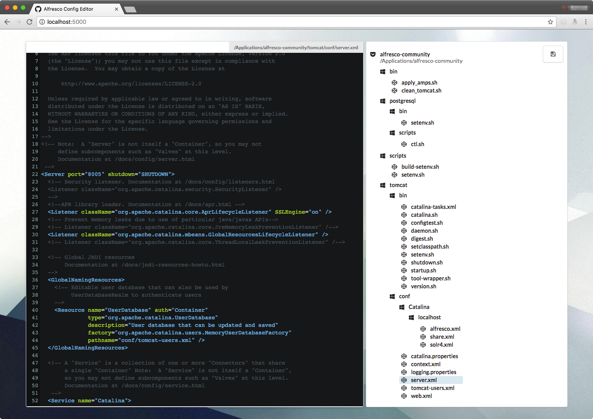

## Alfresco Config Editor



## Development

```bash
# create project
elm-package install elm-lang/http

# build
elm-make src/Index.elm --output=dist/main.js

# watch
watchman-make -p 'src/*.elm' --make='elm-make src/Main.elm --output=backend/ConfigEditor/wwwroot/dist/Main.js' -t ""

# start server
./build.sh --target Watch-Run

# publish
# https://docs.microsoft.com/en-us/dotnet/core/rid-catalog

dotnet publish -c release -r win10-x86  -o ../../dist/Windows backend/ConfigEditor
dotnet publish -c release -r osx-x64    -o ../../dist/Mac     backend/ConfigEditor
dotnet publish -c release -r ubuntu-x64 -o ../../dist/Linux   backend/ConfigEditor
```